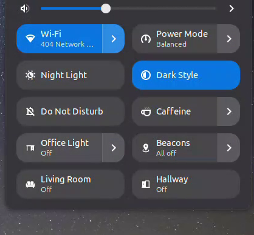
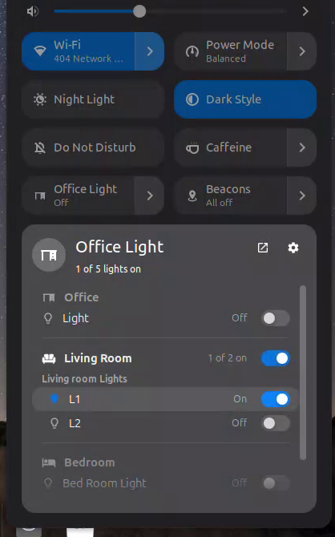
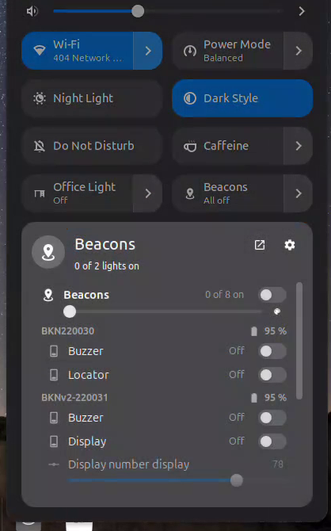
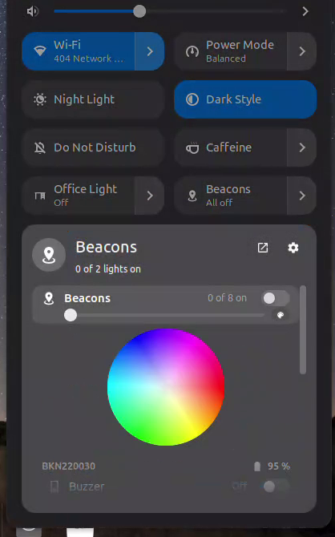
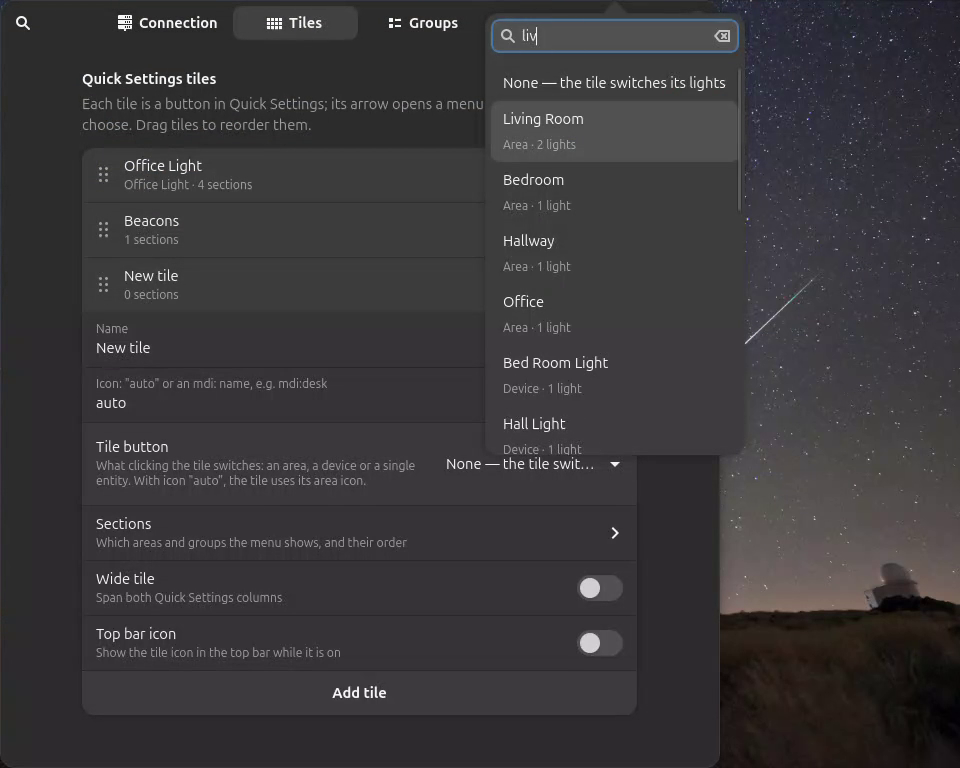
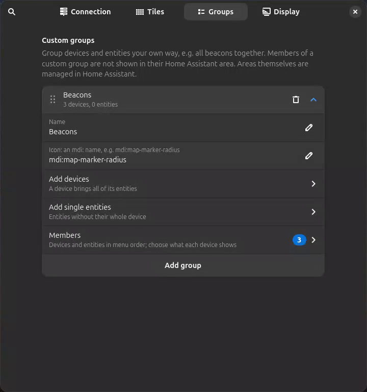
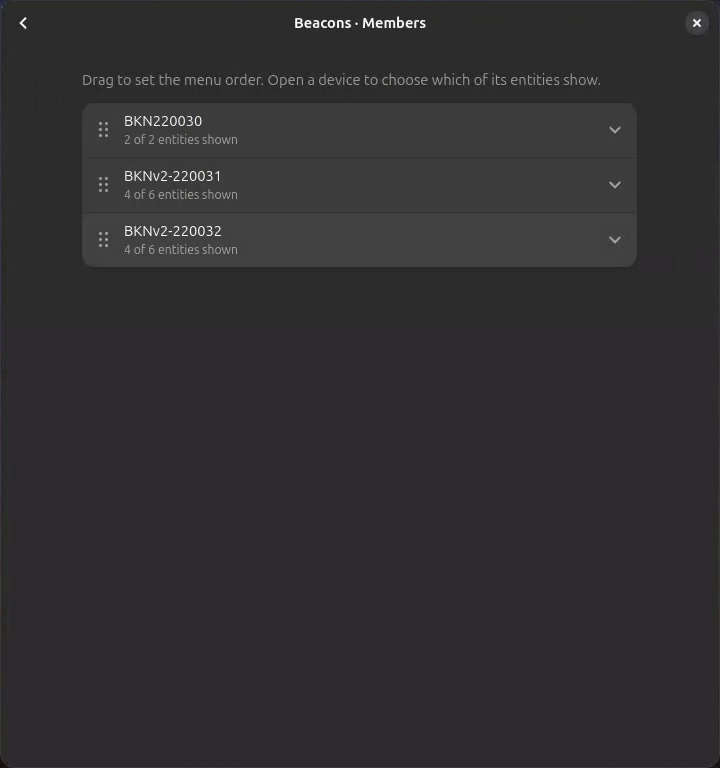
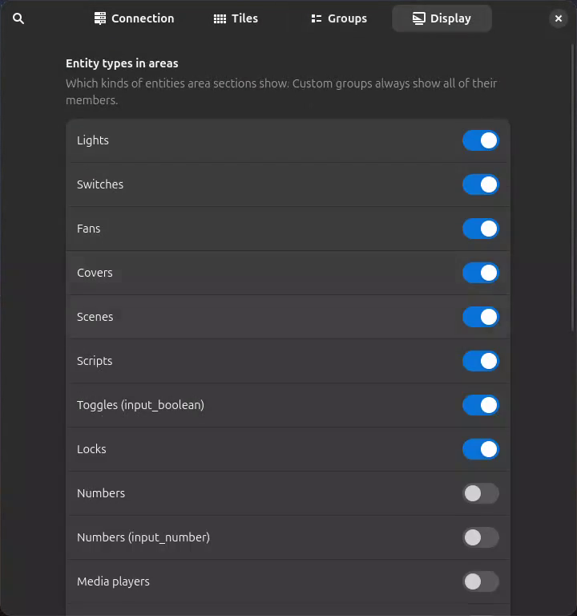

# Home Assistant Tiles

Control [Home Assistant](https://www.home-assistant.io/) from GNOME Quick Settings.
Every tile is a normal Quick Settings toggle: click it to switch a room, a device or a
single entity, open its arrow for a menu of everything in the sections you picked.

<p align="center">
  
  
  
</p>

**[▶ Watch the demo video](docs/demo.mp4)** (1½ minutes: tiles, menus, color picker and settings)

## Features

- **Live, instant state.** One WebSocket connection subscribes to every entity, so switches,
  sliders and tiles follow changes from wall switches, the app or automations immediately.
  It reconnects on its own after network changes or suspend.
- **Tiles that switch what you want.** A tile's button can switch an **area**, a **device**
  or a **single entity**. With the icon on *auto*, the tile uses the area's icon from
  Home Assistant (the desk for an office, the sofa for a living room).
- **Menus organised your way.** Sections come from your Home Assistant areas, plus
  **custom groups** of devices and entities you define (for example, all beacons together).
  Drag to reorder tiles, sections and group members; choose which entities of a device show.
- **Controls follow capabilities.** A light gets a brightness slider only if it can dim,
  and a color wheel or color temperature bar only if it supports them. Covers get
  position and open/stop/close, fans get speed, numbers get a slider, sensors show their value.
  Section headers get combined controls only when two or more members support them.
- **Device cards.** Devices with several entities are grouped under their name, with their
  battery level in the header.
- **Home Assistant icons.** Material Design Icons, as used by Home Assistant, rendered as
  GNOME symbolic icons. Common icons are bundled; others are downloaded once and cached.
- **Settings that read your home.** Pick areas, devices and entities by name, with search.
  If the [Smart Home](https://github.com/vchlum/smart-home) extension already has a
  Home Assistant connection, it can be imported in one click.

<p align="center">
  
  
</p>

## Requirements

- GNOME Shell 48, 49, 50 or 51
- Home Assistant with a [long-lived access token](https://developers.home-assistant.io/docs/auth_api/#long-lived-access-token)
  (in Home Assistant: your profile → Security → Long-lived access tokens)

## Installation

```sh
git clone https://github.com/slimani-dev/ha-tiles.git
cd ha-tiles
make install
```

Log out and back in (GNOME only loads new extensions at login on Wayland), then enable it:

```sh
gnome-extensions enable ha-tiles@slimani.dev
```

## Setup

Open the settings with `gnome-extensions prefs ha-tiles@slimani.dev`, or with the gear
button in any tile's menu.

1. **Connection:** enter your Home Assistant URL and access token, or import them from
   the Smart Home extension. The status line confirms the connection.
2. **Tiles:** add a tile, choose what its **Tile button** switches (an area, a device or an
   entity), and under **Sections** pick which areas and groups its menu shows. Drag to set
   their order. A tile without sections has no menu and works as a plain toggle.
3. **Groups** (optional): create custom groups from devices or single entities. Under
   **Members**, drag them into order and open a device to choose which of its entities show.
4. **Display:** choose which kinds of entities area sections show, whether section headers
   get combined controls, and hide entities you never want to see.

<p align="center">
  
  
  
</p>

## How it works

- **Connection:** `lib/haClient.js` keeps one WebSocket open to `/api/websocket`. It loads the
  area, device and entity registries, subscribes to all entity states with
  `subscribe_entities`, listens for registry changes and sends service calls. Application-level
  pings detect dead connections; reconnects back off up to 30 seconds.
- **Menus:** `extension.js` builds one Quick Settings tile per configured tile.
  `lib/entities.js` works out sections, members and capabilities; `lib/widgets.js` builds the
  rows and headers; `lib/color.js` draws the color wheel and temperature bar with cairo.
- **Icons:** `lib/icons.js` looks up Material Design Icons in `icons/mdi` (bundled), then
  `~/.cache/ha-tiles/mdi`, then downloads them from the `@mdi/svg` package on jsDelivr.
  `make icons` refreshes the bundled set.

Your URL and token are stored in GSettings (dconf) under
`/org/gnome/shell/extensions/ha-tiles/`, readable by your user only.

## Development

```sh
make lint      # syntax check and schema validation
make install   # pack and install for the current user
journalctl -f -o cat /usr/bin/gnome-shell | grep "Home Assistant Tiles"
```

Turn on **Display → Debug logging** for connection details in the journal.

## Credits

- Icons: [Material Design Icons](https://pictogrammers.com/library/mdi/) by Pictogrammers,
  under the [Pictogrammers Free License](icons/LICENSE-mdi).
- Inspired by [Smart Home](https://github.com/vchlum/smart-home) (the Home Assistant
  integration) and [Custom Command Toggle](https://github.com/StorageB/custom-command-toggle)
  (the Quick Settings tiles).

## License

[GPL-2.0-or-later](LICENSE)
